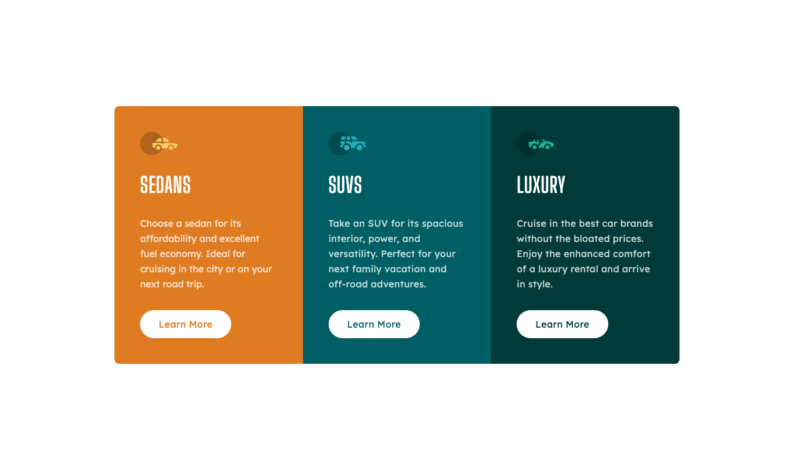
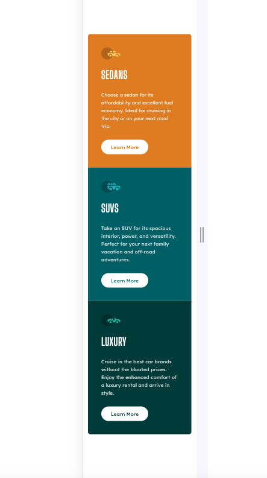

# Frontend Mentor - 3-column preview card component solution

This is a solution to the [3-column preview card component challenge on Frontend Mentor](https://www.frontendmentor.io/challenges/3column-preview-card-component-pH92eAR2-). Frontend Mentor challenges help you improve your coding skills by building realistic projects.

## Table of contents

- [Overview](#overview)
  - [The challenge](#the-challenge)
  - [Screenshot](#screenshot)
  - [Links](#links)
- [My process](#my-process)
  - [Built with](#built-with)
  - [What I learned](#what-i-learned)
  - [Continued development](#continued-development)
  - [Useful resources](#useful-resources)
- [Author](#author)
- [Acknowledgments](#acknowledgments)

## Overview

### The challenge

Users should be able to:

- View the optimal layout depending on their device's screen size
- See hover states for interactive elements

### Screenshot




### Links

- Solution URL: (https://your-solution-url.com)
- Live Site URL: (https://your-live-site-url.com)

## My process

### Built with

- Semantic HTML5 markup
- Tailwind CSS
- Flexbox
- CSS Grid
- Mobile-first workflow

### What I learned

I have acquired proficiency in using proper semantic HTML and enhanced my skills in Tailwind CSS.

```html
<h1>Semantic HTML</h1>
```

```css
bg-white py-3 px-8 text-darkCyan font-lexend rounded-full capitalize font-[400] tracking-wide hover:bg-darkCyan hover:text-white hover:border-2 border-white ease-out duration-100 cursor-pointer
```

### Continued development

In the near future, my primary focus revolves around mastering JavaScript and Tailwind CSS to enhance my proficiency in web development. JavaScript, as a versatile programming language, is at the forefront of modern web development, enabling dynamic and interactive user experiences. With its extensive ecosystem and widespread adoption, I aim to delve deeper into advanced concepts such as asynchronous programming, ES6 features, and frameworks like React or Vue.js. Concurrently, my attention is directed towards Tailwind CSS, a utility-first CSS framework that streamlines the styling process with its modular and responsive design approach. Embracing Tailwind CSS allows me to expedite the development process while maintaining a clean and maintainable codebase. By combining these skills, I aspire to create seamless and visually appealing web applications, staying abreast of the latest trends and technologies in the ever-evolving landscape of front-end development.

### Useful resources

- [Tailwind CSS documentation](https://tailwindcss.com/docs/installation) - This helped me for faster development. I really liked this pattern and will use it going forward.
- [Chat GPT](https://chat.openai.com/) - has anyone never asked for help from this AI? 😆

## Author

- Website - [Johnrome Pangon](https://www.your-site.com -- in progress)
- Frontend Mentor - [@H4irram](https://www.frontendmentor.io/profile/H4irram)

## Acknowledgments

Tip myself for this. I still finished this simple project after my 8 hrs shift work.
